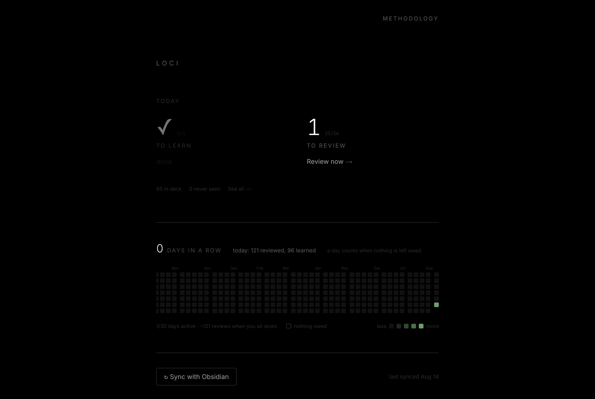
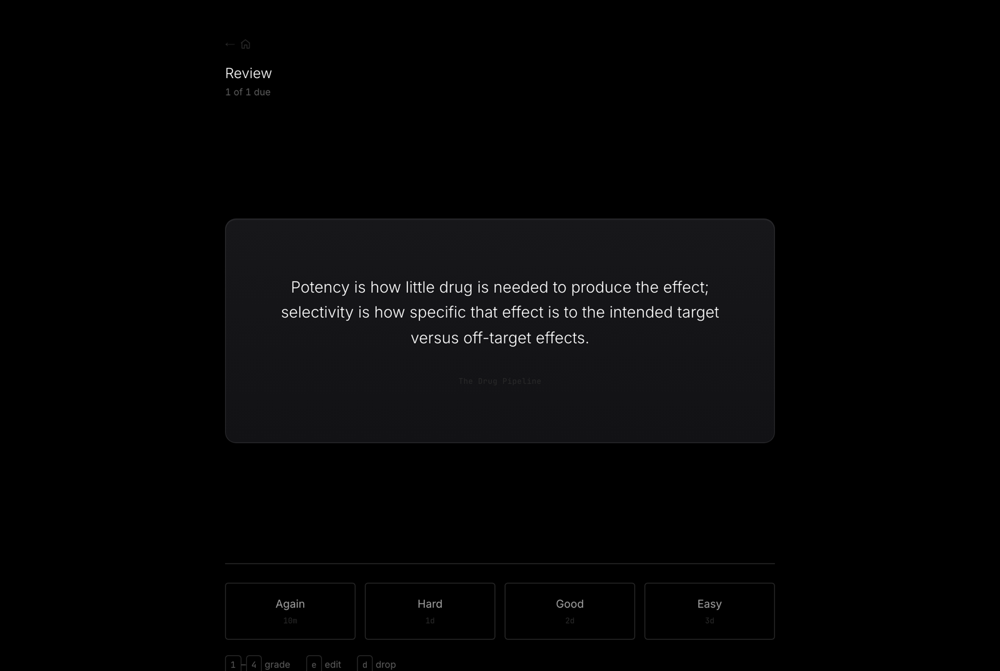
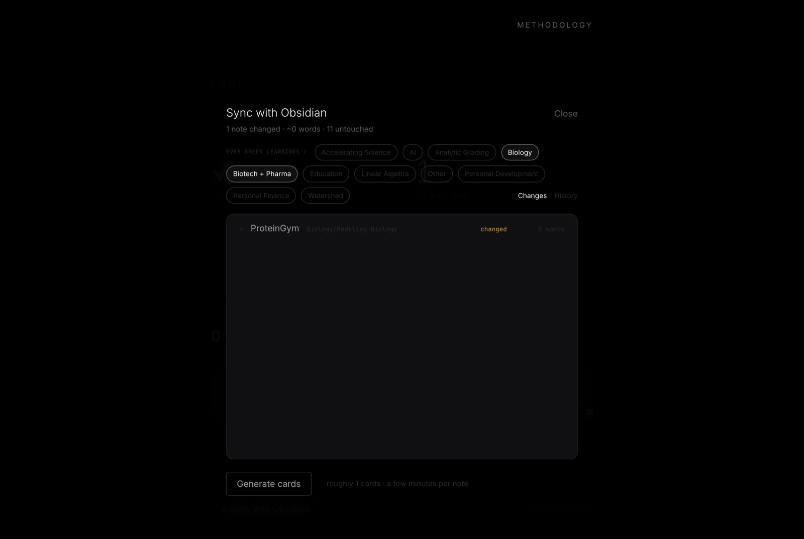
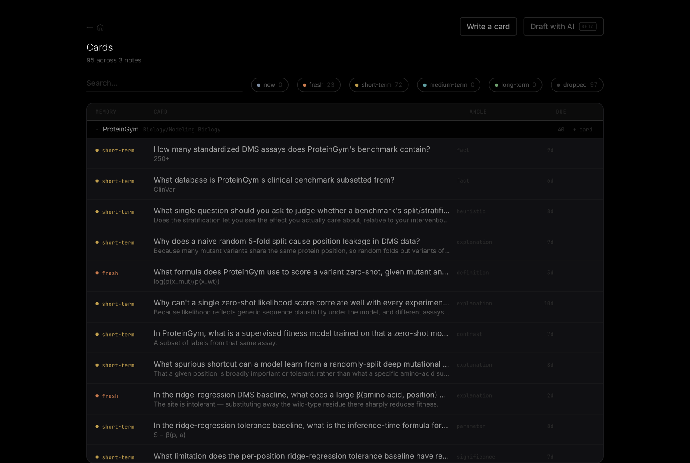
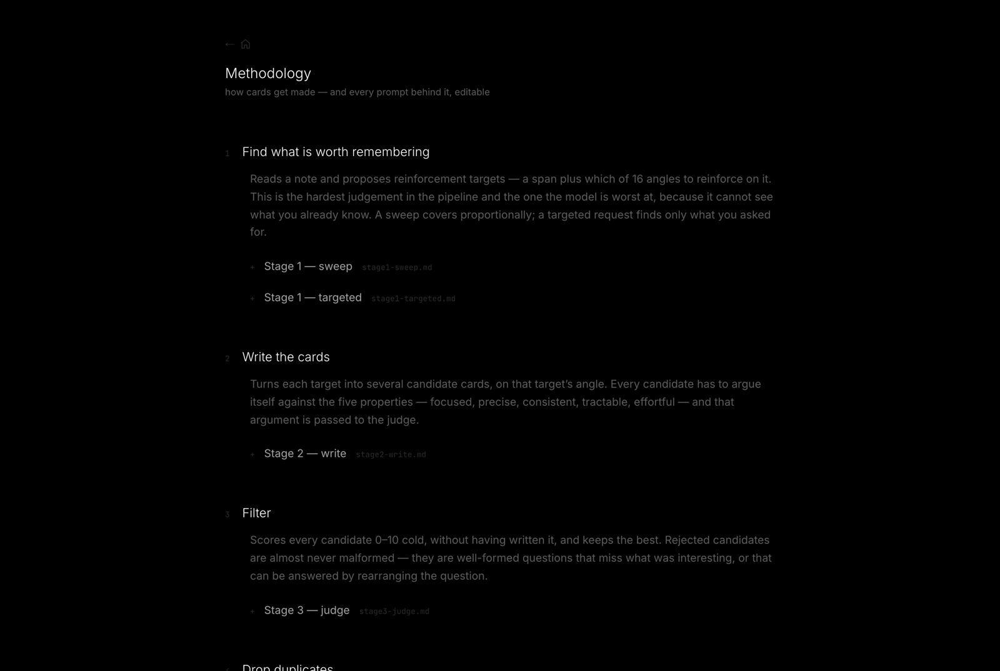
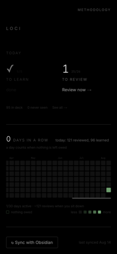
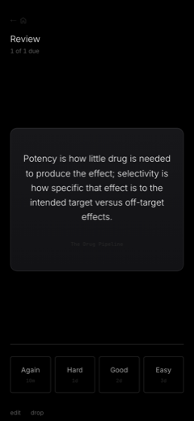
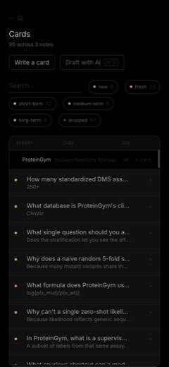

# Loci

A spaced repetition memory system fed by an Obsidian vault.

Every sync reads what changed in the vault, writes prompts covering it, and puts them into an
FSRS deck. The design rationale — and the evidence behind each choice — is in
[`docs/prompt-principles.md`](docs/prompt-principles.md), distilled from Andy Matuschak's notes
on prompt writing.



<table>
<tr>
<td width="50%"></td>
<td width="50%"></td>
</tr>
<tr>
<td></td>
<td></td>
</tr>
</table>

<p align="center">
  
  
  
</p>


---

## How it works

```
vault ──▶ diff ──▶ ① targets ──▶ ② write ──▶ ③ judge ──▶ dedup ──▶ deck ──▶ [ you grade or drop ]
          hashed   span+angle    3 drafts    keep 1      vs. deck   active   vetting is the review
```

**The diff engine** keeps its own snapshot — full note text plus a hash per semantic block —
rather than leaning on git. A changed note is found by content hash; the changed *parts* by block
hash. Blank-line-separated list runs merge back into one block, so a four-step mechanism stays one
unit rather than four; oversized outlines then split along their own indentation, so a note
written as one deep nested list doesn't collapse into a single block that reads as wholly changed
every time one bullet moves. Blocks keep their ancestor bullets as a breadcrumb path.

A block whose hash disappears isn't assumed deleted — its text has to be genuinely absent from the
note. Cards are pinned to the hash of the block they came from, so without that check, any change
to how the splitter draws boundaries would retire most of the deck at once.

The snapshot is committed **per note, after that note has been extracted from**. Committing it up
front means a run that's cancelled or crashes halfway leaves every note it never reached looking
already-read, and the next sync passes over them in silence.

**Flagging beats guessing.** Writing `***` beside a passage marks it as load-bearing: the sweep
covers it more thoroughly and the note's target budget grows to make room, so a flagged paragraph
earns several cards where its neighbours earn one. Choosing what deserves a prompt is the judgement
the model is worst at, and this is the cheapest channel for overriding it. The marker and how much
it is worth are both tunable from `/methodology`.

**Stage 1 proposes targets, not cards.** A target is a span plus an *angle* — which of thirteen
lenses on that span is worth reinforcing. Choosing what deserves a prompt is much harder than
writing a prompt about a chosen detail, so the two are separated. The count is proportional to how
much changed (~1 target per 110 words), and the diff selects targets without bounding context:
the extractor always sees the whole note plus linked notes.

**Stage 2 writes, stage 3 judges.** Three candidates per target, scored against the five
properties of a good prompt, one kept. A cheaper model then checks each survivor against what's
already in the deck — trigram Jaccard for the certain cases, a model call only for the grey band.

**Cards go straight into the deck.** There's no approval queue. Vetting happens on a card's first
encounter under *Learn*, because grading a card and judging it are the same act of reading — doing
it twice is the wasteful version. <kbd>d</kbd> drops a card at any point in its life, and the
reason is written to `extraction_feedback` to sharpen later runs.

**Review is self-graded, four buttons.** Self-grading beats machine grading on efficiency, false
negatives, and the variety of prompts it permits. Three lapses routes a card to rewrite, because a
prompt you keep forgetting is a broken prompt, not a broken memory.

Once the answer is up, <kbd>?</kbd> asks the model to elaborate on it and <kbd>c</kbd> copies the
whole card — question, answer, context, the source passage it was written from, angle and tags — as
markdown, for asking follow-up questions somewhere a conversation is possible. Both live on the
answer side because both contain the answer; offering either while you are still trying to remember
would spoil the card to save a keystroke.

### Daily goals

The home page leads with today, not the deck total — a total only goes up when you write more, so
it reads as debt however much work you do.

**20 new cards a day, 20 reviews.** A card needs roughly eight to ten reviews to reach multi-year
stability, so steady-state review load is about 8–10× the daily new-card rate, permanently — which
makes 20 an ambitious intake against a 20-review ceiling. The trade is deliberate: the deck is fed
by one person's writing, so clearing the queue after a sync matters more than holding the two
numbers in balance. The review number is a cap rather than a quota — on the day you return to a
backlog it time-boxes the dig instead of asking for three hundred cards. It also sizes the session
itself, so a sitting is a day's worth of cards and carrying on is a second, deliberate trip through
the home page. Both are `dailyNew` and `dailyReviewCap` in the config, tunable under **Tuning** on
/methodology; if due counts climb week over week, lower the intake.

Under today's numbers is a five-step read on **deck health**: *losing ground · behind · slipping ·
on track · ahead*, on a red-to-green severity ramp (`--sev-1` through `--sev-5`). Deliberately not
the memory-horizon palette: there, warm means a memory is young, and a young memory is not bad
news. It is deliberately not built on how many cards are overdue, because a queue is
not a memory. At the time of writing this deck carried 72 overdue cards, the oldest twelve days
late, and its mean recall was 90% — exactly the retention it targets. An overdue count would have
shouted at a deck that was fine.

So the primary signal is FSRS retrievability: how many memories have measurably decayed, taking
each card's own interval into account. A card on a 44-day interval that is five days late sits at
97%; a card on a one-day interval five days late sits at 65%. Both read as "5 days overdue". Below
80% a card has slipped, below 60% it comes back close to new. The depth of the queue is the second
signal, in sittings rather than cards, because a backlog you can't clear becomes decay soon enough
even when nothing has decayed yet. Only actual forgetting reaches the worst state — a deep queue
with intact memory tops out at *behind*, since by the model's own account it is just work.

Beneath it is the **memory map**: the forgetting curve, with every card you have actually learned
sitting on it. Never-learned cards are left out — a card you have not met has no stability, so
there is no curve it sits on and no recall to estimate; including it would mean inventing a
position for a memory that does not exist.

There is one curve, not one per card. FSRS recall depends on elapsed time only through `t / S`, so
every card is somewhere along the same shape, and `x = 1` is by definition where recall has fallen
to 90% — that is what stability means. It is drawn against **log time**, and has to be: recall
reaches 90% at `x = 1` and 80% at `x = 3.3`, but not 60% until `x = 27`. On a linear axis long
enough to show the whole shape, every card in a healthy deck is crushed into the leftmost tenth.
Ebbinghaus plotted his the same way.

The shaded stripe is **the verge**, the stretch of curve between 90% and 80% recall, and it is the
point of the entire system: a card is worth reviewing when it is on the verge of being forgotten.
Recall it at 99% and the review costs effort and buys almost nothing; recall it at 40% and you are
learning it again from scratch.

The stripe runs vertically rather than horizontally because **both** axes encode recall here — a
card sits on a one-dimensional curve, so nudging it aside to stop it hiding behind another card
moves it off the line in some direction. Horizontal position is what survives that (a median of
half a percentage point out); vertical is not. A horizontal band would have told you a card packed
below the 80% line was slipping when it isn't.

Cards settle into place by pushing each other apart against a spring pulling each back to where it
belongs, rather than stacking into a lattice. Forty-eight of them currently sit within a percentage
point of each other; drawn strictly on the line they would be one dot with forty-seven hidden
underneath. Dot size is stability — a memory that holds for months is a bigger thing than one that
holds for a day. Point at any dot for the card, its recall, how long it holds and when it is due.

The headline on the activity graph is **days done** — every day you reviewed anything, all-time,
and a number that only ever goes up. The streak beside it counts consecutive days with reviews. It
used to count days that ended with nothing owed, which is a better description of keeping up and
unusable as a number: one card left overdue marks every day since as a failure, so the past changed
on the strength of the present. What's owed is still reconstructed from history — each review
carries the card's prior due date — and still shown per-day in the graph, where a day that owed
nothing gets an outline. New cards don't count towards it: they're elastic, and a day spent not
learning something new costs nothing you already had.

---

## The app

| | |
|---|---|
| `/` | today's goals, streak, a year of activity, sync |
| `/new` | learn cards never seen — grade, edit, or drop |
| `/review` | what's due |
| `/cards` | every card grouped by source note, with memory tier |
| `/add` | ask for specific cards in one forward pass |
| `/methodology` | how extraction works — and every prompt, editable |

**Sync with Obsidian** opens a three-step modal: the diffs it found (accordion, scoped by folder
under `Ever Green Learnings`), then generation with a live clock and a cancel button, then a sweep
through what it wrote. A History tab keeps every past run with the diff text it read, so a batch of
weak cards can be traced back to the edit that produced it.

Everything works on a phone — the card is a large tap target that flips, every keyboard shortcut
has a button behind it, and `viewport-fit=cover` plus `dvh` units keep the grade buttons clear of
the home indicator. Add it to the home screen and it opens without browser chrome.

**Every prompt is editable at runtime** from `/methodology` — the files in `prompts/` are read from
disk per run, not baked into the build. So is the tuning in `prompts/config.json`.

### Who runs the models

One switch, `provider` in `/methodology`, and **everything follows it** — grading a typed answer,
all four extraction stages, and Add cards. There are exactly two settings:

| | what runs | needs |
|---|---|---|
| **`claude`** *(default)* | `claude-sonnet-5` for stages 1–3 and Add cards, `claude-haiku-4-5` for the duplicate check and grading | `ANTHROPIC_API_KEY` |
| **`ollama`** | `gpt-oss:120b` for all of it, on Ollama's hosted service | `OLLAMA_API_KEY` |

Ollama means one model. Not a list, not a local install — `gpt-oss:120b` on ollama.com, which
their free tier covers. It is the one measured to do the job: 18/18 on the grading benchmark,
against 13/18 for `nemotron-3-nano:30b`, which scored a flatly wrong answer as correct.

Running models on the laptop was the first version of this and it is gone. It was free and
private, but every path in the codebase became conditional on which machine was running it — a
local Ollama truncates long prompts silently, needs its context sized per call, has to be
installed and pulled before anything works, and cannot be reached from a deployment at all. The
hosted service has none of those properties, so none of that code exists any more.

**`claude` is the default, and on the evidence it should stay that way for extraction.** Same
note, same prompt, stage 1:

| | targets | rationales | speed | cost |
|---|---|---|---|---|
| `claude-sonnet-5` | 14 | say *why forgetting it hurts* | 73s | ~$0.11 |
| a mid-size open model | 9 | mostly restate what the passage *is* | 98s | free |

Four of the top six were the same spans — the open model finds the material, it loses the
judgement around it. Grading is the opposite case: it is one cheap comparison per card, forever,
and `gpt-oss:120b` matches a human on it. Decide for yourself rather than taking the table's word
— both benchmarks read real data and write nothing:

```sh
npm run bench:grade                                    # rubric vs known-good gradings
NOTE="$VAULT_PATH/…/Some Note.md" npm run bench:extract  # stage 1, both providers
```

### Two ways to answer

Every session has a toggle in its top-right corner.

**self** is the original flow: reveal the answer, decide for yourself how well it came back.

**type it** asks you to write the answer first, and a model scores it into the same four grades.
It exists because it is impossible to think *"I knew that"* at a blank screen and be wrong —
self-grading measures confidence, and typing measures recall.

The grade is a **proposal, not a verdict**. It appears alongside the real answer with the model's
reasoning and whatever it thought you missed, with its pick outlined on the grade buttons.
`↵` accepts it, `1`–`4` overrides it, and nothing is written until you do one or the other. Every
review records both numbers, so `grader_rating <> rating` is the running list of places the
auto-grader is wrong, with the answer that fooled it in the same row. Flip `graderAutoAccept` in
`/methodology` once the disagreements stop being interesting.

Cards with no reference answer — the open, catechism-style ones — always fall back to self-grading.
A grader with nothing to compare against is guessing, and its guesses would land in the very log
being used to judge it. `s` hands any other card back to you too.

Which model grades follows `provider` like everything else — `gpt-oss:120b` on Ollama's free
tier, or `claude-haiku-4-5`. The rubric it applies is `prompts/grade-answer.md`, editable from
`/methodology`; it is prose, and prose has no tests, so measure an edit with `npm run bench:grade`
rather than trusting it. The first draft of that rubric scored 15/17 *and gave every correct
answer an Easy*, which would have quietly stretched every interval in the deck. Nothing surfaced
that except running the benchmark.

---

## Setup

### 1. Environment

`.env.local` (see `.env.example`):

```sh
SUPABASE_URL=https://<project-ref>.supabase.co
SUPABASE_SECRET_KEY=sb_secret_...
ANTHROPIC_API_KEY=sk-ant-...
VAULT_PATH=/Users/…/iCloud~md~obsidian/Documents/Life
VAULT_FOLDERS=Ever Green Learnings,Ever Green Notes
```

### 2. Database

Run the migrations in `supabase/migrations/` in order, in the Supabase SQL editor. Or with the CLI:

```sh
supabase link --project-ref <ref>
supabase db push
```

Every table has RLS enabled with no policies — deny-all. All access goes through this app's route
handlers using the secret key; the browser never talks to Postgres directly. That's what lets a
mobile client hook into the same deck later without the schema changing.

### 3. Run

```sh
npm run doctor     # env, vault, schema, model — check all four at once
npm run scan:dry   # report what changed; no model calls, no writes
npm run scan       # full pipeline
npm run dev        # http://localhost:3000
```

`npm run scan` takes flags: `--only <folder,folder>` to scope by path fragment, `--paths <a.md,b.md>`
with `--request "<what to extract>"` for a targeted run, `--force` to re-extract regardless of the
snapshot (what you want after editing the prompts, when the vault hasn't changed but the output
would), and `--cron`.

### 4. Ollama (optional)

Only needed if you set `provider` to `ollama`. Get a key at
[ollama.com/settings/keys](https://ollama.com/settings/keys) and put it in `.env.local`:

```
OLLAMA_API_KEY=…
```

That is the whole setup. Nothing to install, nothing to pull, and the same key works locally and
on a deployment — which is the point of having dropped the local path.

Free-tier usage resets on rolling 5-hour and 7-day windows, so a very heavy session could hit a
limit. A grade that fails for any reason falls back to self-grading that one card rather than
losing it; an extraction stage that fails aborts the run and says why.

### 5. Hosting

The web app deploys anywhere. The two features that read the vault — **Sync with Obsidian** and
**Draft with AI** — need the markdown on the same machine, so a hosted copy greys them out and
says why rather than failing. Reviewing, browsing, editing and writing cards by hand all work
fine hosted, since they only need Postgres.

Recall mode works hosted with no extra configuration, whichever provider you are on — both are
just an API key, which is exactly why the local option is gone.

Prompts are also read-only when hosted: the filesystem is, so `/methodology` shows them but can't
save. Edit them in the repo, or locally.

The hosted copy is open by default. If you'd rather keep the deck to yourself, set
`LOCI_PASSWORD` on the deployment: every page and API route then sits behind it — one password,
one cookie that lasts a year per device, a `Bearer` header for anything that isn't a browser.
On the phone: Safari → Share → **Add to Home Screen**. The manifest and icons are in place, so it
installs with its own icon and opens fullscreen.

---

## Nightly

Once the output has earned trust, `npm run scan` on a schedule. On macOS, launchd fires a missed
`StartCalendarInterval` job at next wake, so a closed laptop only delays the scan rather than
skipping it.

```xml
<!-- ~/Library/LaunchAgents/com.loci.scan.plist -->
<key>ProgramArguments</key>
<array>
  <string>/bin/bash</string><string>-lc</string>
  <string>cd /Users/josephtey/Projects/loci && npm run scan -- --cron</string>
</array>
<key>StartCalendarInterval</key>
<dict><key>Hour</key><integer>3</integer><key>Minute</key><integer>0</integer></dict>
```

---

## Cost and tuning

`claude-sonnet-5` for stages 1–3, `claude-haiku-4-5` for deduplication. A full sweep of 92 notes
came to 137 cards for about $5 — most of the prompt is identical across calls, so cache hits run
near 40%.

The knobs live in `prompts/config.json` and are editable from `/methodology`: words per target,
candidates per target, the keep threshold, batch size, the two duplicate-similarity bands, and
per-stage reasoning effort. The ceiling that matters isn't cost, it's review time — see *Daily
goals* above. Dropping the error rate from 20% to 5% buys a third more prompts in the same review
time, which is why stage 3 exists.

---

## Layout

```
docs/prompt-principles.md   design spec; §2–4 injected verbatim into the extractor
prompts/                    every extraction prompt, editable at runtime
supabase/migrations/        schema
src/scanner/                local CLI — vault, blocks, sync, prompts, extract, doctor, reset
src/lib/llm.ts              every model call in the project, either provider
src/scanner/*-bench.mts     grade-bench (rubric vs known-good gradings), extract-bench
                            (stage 1 on one note, provider vs provider); neither writes anything
src/lib/                    types, supabase client, FSRS wrapper, queries, goals, grader
src/app/api/                scan control, review grading, card CRUD, sync preview/result/log
src/components/             review session, sync modal, activity graph, day detail
```

`reviews` is append-only and is the actual asset. Everything else is derived from it. With the
full log the FSRS parameters can be re-fit to your own history after ~200 reviews, or the whole
deck replayed through a different scheduler; with only `next_due` you'd be locked to today's
weights forever. Recall mode widens that same row rather than adding a table of its own: the
typed answer and the grade the model wanted sit next to the grade that was actually scheduled.
